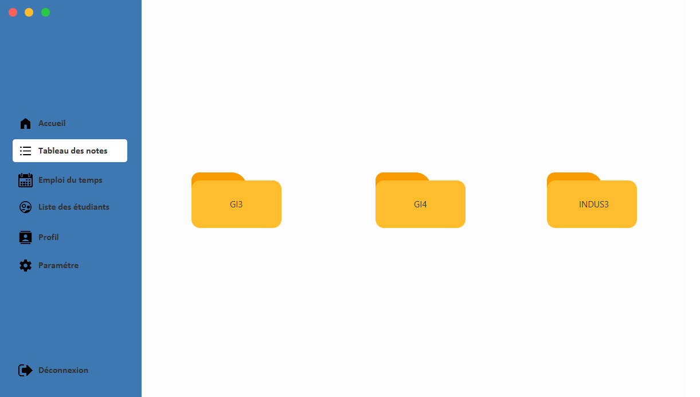
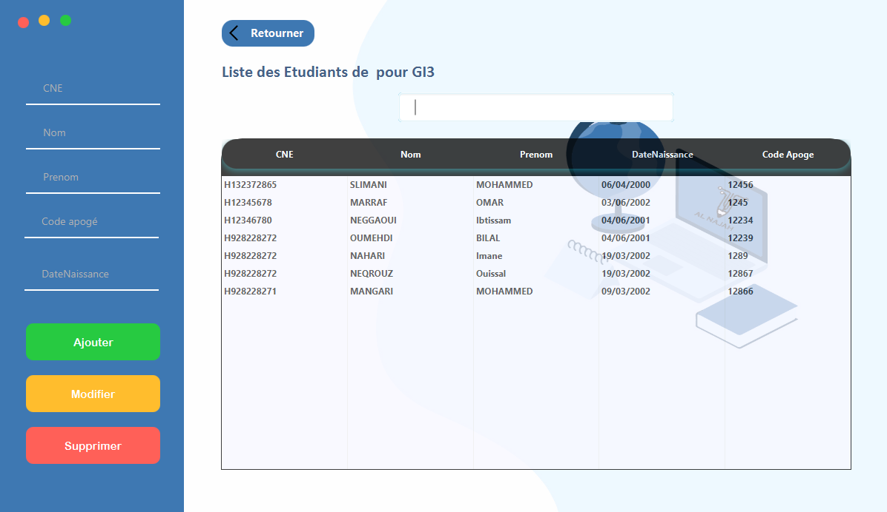

# JavaFX-applicatin-Najah

       De nos jours, les applications bureaux sont devenues incontournables. Un espace quel que soit sa taille, doit avoir recours au moins à une application pour offrir une large palette de documents utiles et des fonctionnalités sur mesure à ses utilisateurs. 
       

       

       Dans ce cadre notre équipe a eu l’idée de créer une application bureau de gestion des notes des étudiants, nommée « Najah » programmée en JavaFX et reliée à une base de données MySQL. 
       

<h3>Screen shot</h3>

 

 

 

 

 

 

 
